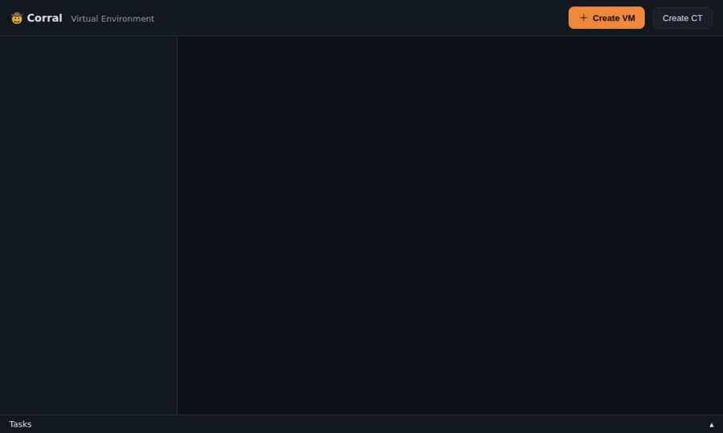

# 🤠 Corral

**Herd your VMs — and containers — into your tailnet.**

Your VMs have escaped. Quick ones sit on your laptop, and big ones sit on the
Kubernetes cluster in the closet. There is an Incus server that's too useful to
replace, and a libvirt host that answers over SSH. There is also a Proxmox node
that you still mean to retire one day. Five sets of tooling, five networking
stories, and none of it reachable from the couch.

Corral fixes that. One command works on every backend: local QEMU/KVM,
KubeVirt, Incus, libvirt, Proxmox VE, or a federated Corral peer. And every VM
lands inside the one network that all your devices already share — your
Tailscale tailnet.

```bash
corral create web --kubevirt --container-disk quay.io/containerdisks/fedora:42
corral ssh web        # from this machine, your laptop, or your phone's terminal
```

VMs are cattle. Don't treat each one like a networking project.



*↑ that's `corral web --demo` — try the whole dashboard yourself in 30 seconds, no cluster needed.*

<details><summary>Screenshots: datacenter view, VM summary with live CPU, mobile view</summary>


</details>

## Why you'll like it

- **Same commands everywhere.** `create` / `start` / `ssh` / `viewer` /
  `clone` / `delete` work the same on every backend context. That means local
  QEMU/KVM, KubeVirt on your cluster, Incus, libvirt, or a federated Corral
  peer. A peer tries advertised or direct guest endpoints first, and falls
  back to an HTTP/WebSocket relay. See the
  [backend support matrix](docs/backend-support.md). Corral remembers which
  is which, so you never specify it again.
- **One fleet, not five tabs.** Corral aggregates every configured context at
  once. `corral list`, the TUI and the dashboard show the whole fleet.
  `corral context use NAME` only chooses where *new* work lands. It never
  hides the rest, and it never mutates kubectl's or Incus's own global config.
  Authentication stays boring on purpose. It reuses an existing Incus remote's
  trust, a `qemu+ssh://` URI through your OpenSSH agent and config, or a PVE
  API token. `corral doctor` runs scoped checks against every target and
  `--context NAME` narrows it to one.
- **Move a VM to a different backend.** `corral move <vm> --to <backend>`
  exports the disk, converts it, and ingests it on the destination. Then it
  verifies the result. It's *cold* and never pretends otherwise — the guest stops, and
  `corral migrate` remains the live, within-one-backend kind. Preflight
  refuses before it touches anything. It reports every reason at once:
  firmware, disk bus, free space, the new MAC/IP. `--dry-run` only prints the
  plan. Corral leaves the source **stopped, not deleted** unless you pass
  `--delete-source`. Disk export works on every backend on its own too —
  qcow2, raw.gz, or an Incus tarball. See
  [ADR-0010](docs/adr/0010-cross-backend-move.md).
- **Your OS is a container image.** Point Corral at a *bootable container*
  (`corral create dev --bootc ghcr.io/...`). Corral builds the OS disk
  on-cluster with `bootc install to-disk`, then boots it as a first-class VM.
  `corral bootc upgrade` rolls the VM to the image's next build — so your
  fleet of VMs updates the same way containers do. No other VM platform has this.
- **A bootc image tester for CI.** `corral vmtest --bootc ghcr.io/...` builds
  the image into a disk and boots it. It waits for the guest, runs your
  assertions, then hands the VM over for your own tests. Test accounts,
  passwords, extra packages and a boot hook go into a layer above the published
  image. corral never changes that image. It writes the evidence as it goes:
  the serial console, screenshots of the boot, a timelapse, and `result.json`.
  It measures whether the screen
  painted at all. A desktop that boots to nothing therefore fails. Each failure
  class gets its own exit code. A pipeline can then tell a runner with no KVM
  from an image that will not boot. See
  [docs/ci-boot-gate.md](docs/ci-boot-gate.md).
- **Containers (CT) — distrobox on Kubernetes.** Proxmox-style pet pods
  alongside VMs (`corral ct create`). A privileged CT seeds a full root
  filesystem onto its own volume, and `chroot`s into it on boot. So `apt` /
  `dnf` / `apk` installs and dotfiles survive Stop/Start. It works the same way
  in a real distrobox container when you stop it and enter it again.
  Unprivileged (default) CTs get only a simple mount of `/data` instead.
- **SSH that works out of the box.** Corral injects your public key at create
  time. It also generates a fallback password and stores it locally.
  `corral ssh` picks the right path: a Kubernetes API tunnel for cluster VMs,
  a Tailscale-bound port-forward for local ones. Or use `--vsock` for QEMU
  AF_VSOCK transport on live ISOs. It changes no config files.
- **VMs that join the tailnet themselves.** Drop a Tailscale auth key in
  `~/.config/tailvm/config.yaml` (or `TS_AUTHKEY`). Then every cloud-init VM
  runs `tailscale up` on first boot. It shows up as a real machine on your
  tailnet, MagicDNS name and all.
- **Extensions with a marketplace.** Niche features ship as plugins:
  `corral plugin search`, then `corral plugin install bootc`. Then
  `corral bootc create dev --image ghcr.io/...` builds an OS disk *on the
  cluster* from a bootable container image. It boots that disk as a VM.
  Browse/install from the web UI's **Extensions** tab too. The core binary
  stays lean.
- **Point-and-shoot TUI.** Run `corral` bare for a Bubble Tea interface. Pick
  a VM and hit Start / Stop / SSH / VNC / Delete. Browse and restore
  **snapshots** on any backend that has them, or read a VM's **events**. Mark
  a **template**, or resize CPU/RAM (VMs *and* CTs). Toggle which ports
  (SSH, VNC, RDP, HTTP, …) Corral publishes to the tailnet as
  `<name>-vm.your-tailnet.ts.net`.
- **A Proxmox-style web UI.** `corral web` serves a dark, mobile-friendly
  dashboard. It has a datacenter → node → VM tree, live status, a create
  wizard, and start/stop/restart/pause. It offers **one-click live
  migration** with a target-node picker, and **multi-select bulk
  start/stop**. It shows **tags** (chips + tree filter) and a per-VM **CPU
  usage sparkline**. It does disk **export** (qcow2 or raw.gz). You can add
  **your own image/ISO sources** alongside the built-in catalog, and Corral
  saves them in a ConfigMap. And it gives you *real consoles in the browser*:
  noVNC graphics and an xterm.js serial TTY. It also runs **on the cluster
  itself** (`deploy/corral-web.yaml`), and the Tailscale operator exposes it
  to your tailnet. CLI, TUI, and web all share the same state.
- **One static binary, written in Go.** No daemons, no controllers to install, no
  client-side K8s SDK. It drives `kubectl`/`virtctl`/`systemctl` — the tools
  you already trust — and gets out of the way.

## Install

One line does it all. The script detects OS/arch and verifies the download
against the release's `SHA256SUMS`. It installs the newest binary, rebuilt on
every push, to `~/.local/bin`, and wires up shell completions (bash/zsh/fish).
It works on Linux and macOS, amd64 and arm64:

```bash
curl -fsSL https://raw.githubusercontent.com/tuna-os/corral/main/scripts/install.sh | sh
```

<details><summary>…or via <code>brew</code> (Linux &amp; macOS)</summary>

Tagged releases land in the [tuna-os tap](https://github.com/tuna-os/homebrew-tap),
so `brew upgrade` keeps you current. The formula is `corral-vm` (homebrew/core
already has an unrelated `corral`), but it still installs the `corral` command:

```bash
brew install tuna-os/tap/corral-vm
```
</details>

<details><summary>…or grab the binary yourself</summary>

This release rolls forward: CI rebuilds it from `main` on every push. It is
not a CI artifact, so there is no GitHub login or expiry:

```bash
curl -fsSL -o corral \
  "https://github.com/tuna-os/corral/releases/download/binaries/corral-linux-$(uname -m | sed 's/x86_64/amd64/;s/aarch64/arm64/')"
chmod +x corral
install corral ~/.local/bin/
```
</details>

<details><summary>…or via <code>go install</code></summary>

```bash
go install github.com/tuna-os/corral@latest
```
</details>

<details><summary>…or build from source</summary>

```bash
git clone https://github.com/tuna-os/corral
cd corral
go build -o corral .
install corral ~/.local/bin/
```
</details>

<details><summary>…or pull the container image</summary>

The same image that runs `corral web` in-cluster also ships the CLI binary.
The image is available for both `linux/amd64` and `linux/arm64`.

```bash
podman create --name corral-extract ghcr.io/tuna-os/corral:latest
podman cp corral-extract:/usr/local/bin/corral .
podman rm corral-extract
install corral ~/.local/bin/
```
</details>

Optional: `corral completion fish | source` (bash/zsh/fish, via Cobra).

**Run the dashboard as a service.** One command installs a systemd unit so
`corral web` starts at boot and restarts on failure:

```bash
corral web service install                  # per-user unit (no root)
corral web service install --system \        # or machine-wide (run under sudo)
  --addr "$(tailscale ip -4):8006"
corral web service status                    # / uninstall / print
```

For a per-user unit to run after you log out, enable linger:
`sudo loginctl enable-linger "$USER"`.

Development tasks run through [`just`](https://github.com/casey/just), and a
bare `just` lists them. They include `build`, `test`, `vet`, `ci` (the
pre-push gate), and `regen-catalog`. That last one refreshes the Universal
Blue / Bluefin / TunaOS bootc catalog from ghcr. It drops any image with no
rebuild in ~60 days.

## Try it in 30 seconds — no cluster needed

`--demo` runs everything against a built-in fake cluster (a varied VM fleet,
containers, nodes, live metrics — start/stop/create/delete all work):

```bash
corral --demo                # the TUI, populated
corral web --demo            # the Proxmox-style dashboard at http://127.0.0.1:8006
corral list --demo           # any CLI command works too
```

## Quick start

```bash
# Local VM on this machine (QEMU/KVM, runs as a systemd user service)
corral create scratch --iso ~/Downloads/ubuntu-24.04.iso
corral start scratch            # VNC + SSH bound to this host's Tailscale IP

# Cluster VM (KubeVirt) from a container disk
corral create web --kubevirt --container-disk quay.io/containerdisks/ubuntu:24.04
corral start web
corral ssh web

# Cluster VM from an installer ISO (CDI imports it for you, progress in `corral list`)
corral create bluefin --kubevirt --iso https://download.example/bluefin.iso

# Bootable container → running VM, disk built on-cluster (bootc extension)
corral plugin install bootc
corral bootc create dev --image quay.io/centos-bootc/centos-bootc:stream9
corral start dev && corral ssh dev -u root

# Everything, both backends, one table
corral list

# Container (CT) — distrobox-style persistent rootfs
corral ct create devbox --image docker.io/library/debian:bookworm --privileged
corral ct console devbox

# Container (CT) from a project's devcontainer.json
corral ct create myproj --devcontainer ./myproj
```

## How VMs are reached

| | Local (qemu) | Cluster (kubevirt) |
|---|---|---|
| SSH | host's Tailscale IP, forwarded port | `virtctl ssh` API tunnel — works with zero exposure |
| VNC | host's Tailscale IP, `vnc://…` | `virtctl vnc` proxy |
| Published ports | — (host is already on the tailnet) | per-VM proxy Service tagged `tailscale.com/expose` → `<name>-vm.<tailnet>.ts.net` |
| VM on the tailnet itself | — | automatic via cloud-init when an auth key is configured |

Corral never binds anything to `0.0.0.0`. Ports of local VMs attach only to
the host's Tailscale IP.

## Extensions & the marketplace

Corral has a krew-style plugin system. Plugins are standalone `corral-<name>`
binaries in `~/.local/share/corral/plugins`; once installed they run as
`corral <name> …`. A curated marketplace (`marketplace/index.json`) lists
installable ones:

```bash
corral plugin search
corral plugin install bootc
corral plugin list
```

The web UI has an **Extensions** tab to browse and install the same plugins.

### The bootc plugin

The flagship extension, `corral bootc`, turns a bootable container image into a
VM that runs, without any local tooling:

1. Corral provisions a block-mode PVC. Then it runs a short-lived **builder
   VM** (not a pod) that runs `bootc install to-disk` onto it. So the VM's own
   kernel does the filesystem work. That lets it install images that the node
   kernel can't handle. An example is Universal Blue desktops (bluefin/dakota)
   that need **btrfs + composefs**. Corral auto-detects the right backend
   (ostree vs composefs) and filesystem from the image. It bakes in your SSH
   key and enables sshd.
2. Build logs stream to your terminal live.
3. The finished disk is self-bootable (GPT + ESP + bootloader), so the final VM
   **UEFI-boots** it — no kernelBoot, no bootloader gymnastics.

`corral bootc rebuild|upgrade|switch` re-bakes the disk from a new image
(Corral applies the SSH key again across the `--wipe`). Rebuild your OS in CI,
`corral create` it as a VM in minutes.

**Faster builds:** deploy `deploy/registry-cache.yaml` (an on-cluster
pull-through cache for ghcr.io). The builder then pulls images through it
automatically, with no config. To turn it off, set
`CORRAL_REGISTRY_MIRROR=off`.

### The backup plugin

`corral backup` ships VM disk backups to any S3/R2 bucket via rclone —
on-demand or scheduled entirely in-cluster (no workstation required):

```bash
corral backup create web --dest r2:backups/corral      # export + upload
corral backup restore web-restored --src r2:backups/corral/web-….img.gz --size 20Gi
corral backup list --dest r2:backups/corral

corral backup schedule web --every 24h --keep 7 --to r2:backups/corral  # in-cluster CronJob
corral backup schedules                                                # list schedules
corral backup unschedule web
```

Needs `rclone` configured for your remote (`rclone config`) and `virtctl`.
Scheduled backups fetch `virtctl`/`rclone` inside the CronJob pod at
runtime and mirror your local rclone config into a namespaced Secret — no
bespoke image required.

### The Windows plugin

`corral windows` sets up UEFI/TPM/virtio for a first-class Windows guest.
KubeVirt VMs default to a Linux-tuned devices set, and Windows Setup can't
boot from it without extra help:

```bash
corral plugin install windows
corral windows create win11 --iso https://example/Win11.iso --cpu 4 --mem 8Gi
```

The plugin imports the installer ISO via CDI. It provisions a UEFI+TPM+q35 VM
with Hyper-V enlightenments. It attaches the virtio-win driver ISO as a second
CD-ROM, so Setup can see the virtio disk/network. It also sets up proper
access to the console.

### The VDI plugin

`corral vdi` — desktop pools. Phase 1 of [RFC-0001](docs/rfc/0001-vdi-plugin.md):
clone an already-built VM into a pool, hand members to users, connect,
release, delete. **Full setup guide: [docs/vdi.md](docs/vdi.md).**

```bash
corral plugin install vdi
corral vdi pool create devpool --from golden-desktop --size 3
corral vdi assign devpool alice
corral vdi connect devpool-1
corral vdi unassign devpool-1
```

There is no broker, no self-serve web page, and no idle reclaim yet. See the
RFC and [issue #69](https://github.com/tuna-os/corral/issues/69) for what's
next. Pool membership and assignment are plain K8s labels on the VM objects,
nothing more.

## Bootc images as a CI boot gate

`corral create --bootc` runs entirely on local QEMU — no cluster, no
tailnet — which makes it a one-command boot gate for bootc images on any
KVM-capable runner. `--wait-ssh` turns the exit code into the verdict:

```bash
corral create gate --bootc ghcr.io/tuna-os/yellowfin:gnome-testing \
  --wait-ssh --timeout 900
# exit 0  → image booted and answers SSH (key injected for root at install)
# exit ≠0 → it didn't; fail the pipeline
corral delete gate
```

The same thing, declaratively (corral reads Lima-style YAML natively):

```yaml
# verify.yaml
bootc: ghcr.io/tuna-os/yellowfin:gnome-testing
cpus: 4
memory: 4GiB
disk: 30GiB
provision:
  - mode: system
    script: |
      #!/bin/sh
      systemctl enable sshd
```

```bash
corral create gate -f verify.yaml --wait-ssh --timeout 900
```

Corral chroots `provision` scripts into the installed disk **before first
boot**. So they can enable services, drop test users, or plant readiness
markers. The published image stays untouched. Corral installs the disk with
`bootc install to-disk --generic-image`, so it boots under plain
SeaBIOS/OVMF anywhere.

On GitHub-hosted runners, enable KVM first:

```yaml
- run: |
    echo 'KERNEL=="kvm", GROUP="kvm", MODE="0666", OPTIONS+="static_node=kvm"' \
      | sudo tee /etc/udev/rules.d/99-kvm4all.rules
    sudo udevadm control --reload-rules && sudo udevadm trigger --name-match=kvm
```

## Ephemeral VMs & garbage collection

Scratch/build VMs are easy to create and easy to forget: a `--bootc`
builder, a one-off boot-gate test, a CI throwaway. They don't clean
themselves up if you `Ctrl+C` out or walk away. `--ephemeral` marks a VM for
`corral gc`, so you don't have to remember it:

```bash
corral create scratch --kubevirt --image bluefin --ephemeral --ttl 2h
# ... time passes, nobody comes back for it ...
corral gc              # stops it — PVCs and disk state survive
corral gc --dry-run     # preview without touching anything
```

Two stages, on purpose:

1. **TTL expires → stopped.** This frees the scarce resource (cluster
   CPU/RAM) at once. The disk stays untouched. If you did need the VM after
   all, `corral start scratch` brings it right back.
2. **Stopped by gc, past the grace period (default 72h, `--delete-after`
   to change it) → deleted.** VM and PVCs, for real. Only VMs that *gc
   itself* stopped are eligible. If you stop one yourself, this clock doesn't
   start. So gc never sweeps up an intentionally-parked VM by surprise.

Run `corral gc` by hand, or point a CronJob at it for hands-off cleanup. gc
never touches a VM without `--ephemeral`.

## Dev containers (scoped MVP)

`corral ct create --devcontainer <path>` reads a project's
`.devcontainer/devcontainer.json` and provisions a Container (CT) from it. It
reads `image`, `postCreateCommand`, `remoteUser`, and `forwardPorts`. If the
file uses `build.dockerfile` in place of `image`, you get an error that points
you at `--image`:

```bash
corral ct create myproj --devcontainer ./myproj
corral ct console myproj
```

`<path>` is the devcontainer.json itself, or a directory that contains
`.devcontainer/devcontainer.json`/`.devcontainer.json`. The CT runs
privileged (persistent rootfs) by default, because that's the whole point of
a dev container. Pass `--privileged=false` to turn that off. Any of
`--image`, `--cpu`, `--mem`, etc. still override what the json would
otherwise set.

This is a scoped MVP, not full devcontainer-spec/VS Code support. Corral
does not support **Features**, `build.dockerfile`, or `postCreateCommand`'s
object form (several named commands that run in parallel). The issue that
tracks this work has the fuller story. For example, VS Code's "Reopen in
Container" could recognize Corral natively.

## Configuration

```yaml
# ~/.config/tailvm/config.yaml
tailscale:
  auth_key: tskey-...   # or export TS_AUTHKEY; flag --ts-authkey overrides
```

`corral config` shows what's active. State lives in
`~/.local/share/tailvm/` (registry + local VM disks). The legacy `tailvm`
tool shares this directory, so existing VMs still work.

Environment overrides (handy for the in-cluster web deployment):

| Variable | Effect |
|---|---|
| `CORRAL_NAMESPACE` | default VM namespace (code default: `corral-vms`) |
| `CORRAL_ADMINS` | comma-separated tailnet logins allowed to mutate; unset = single-user/open (see [Web UI](#web-ui)) |
| `CORRAL_REGISTRY_MIRROR` | override/disable (`off`) the bootc builder's pull-through cache host |
| `CORRAL_BOOTC_BUILD_TIMEOUT` | minutes to wait for a bootc builder VM (default 45) |

## Web UI

```bash
corral web                                  # http://127.0.0.1:8006
corral web --addr "$(tailscale ip -4):8006" # share with your tailnet
```

Or serve it from the cluster (public image built by CI to `ghcr.io/tuna-os/corral`):

```bash
kubectl apply -f deploy/corral-web.yaml
# → https://corral.<tailnet>.ts.net
```

> **Setting up from scratch?** [**Build your own KubeVirt "Proxmox"**](docs/kubevirt-proxmox-setup.md)
> walks through the whole stack — KubeVirt + CDI, the feature gates,
> Longhorn + snapshots, Multus, and Corral itself.

Tailnet membership *is* the authentication — never bind a public interface.
For **authorization**, set `CORRAL_ADMINS` to a comma-separated list of tailnet
logins. Listed users can mutate; everyone else gets a **read-only** UI, and the
API rejects any call from them that mutates state (403). Unset =
single-user/open (the default). Identity comes from the Tailscale ingress headers — see
[ADR-0003](docs/adr/0003-identity-source.md). Feature roadmap:
[SPEC.md](SPEC.md) and [docs/api.md](docs/api.md).

## Command reference

```
corral                  TUI (VMs and Containers side by side)
corral web              Proxmox-style web UI [--addr host:port]
corral doctor           cluster health checks, --fix for safe auto-fixes
corral list             all VMs, every configured context
corral context          get | use <name> | add <name> --backend <bck> | list | rm <name>
corral create <name>    --kubevirt | (default: local qemu)
                        --mem 4G --cpu 2 --disk 20G --iso … --container-disk …
                        --pvc … --node … --cloud-init … --instancetype … --ts-authkey …
                        --storage-class … --ephemeral --ttl 4h
                        --lan | --network-nad ns/name [--bridge-iface net1]  (LAN bridge NIC)
corral gc               [kubevirt] [--dry-run] [--delete-after 72h]
                        stop --ephemeral VMs past their --ttl (PVCs kept),
                        delete them once stopped past --delete-after
corral clone <src> <dst>  [kubevirt] clone a VM's disk + config to a new name
corral plugin           search | install <name> | list | remove <name>   (extensions)
corral start|stop <name>
corral restart <name>   restart a VM
corral pause|unpause    [kubevirt] freeze / resume a running VM
corral scale <name>     [kubevirt] --cpu N --mem 8G (live hotplug when possible)
corral migrate <name>   [kubevirt] --node X  live-migrate to another node
corral move <name>      --to <backend> cold cross-backend move (export →
                          ingest → verify); --dry-run, --delete-source
corral adddisk <name>   [kubevirt] --size 10Gi  hotplug a new disk
corral rmdisk <name>    [kubevirt] --volume PVC  detach a hotplugged disk
corral snapshot …       [kubevirt] create | ls | restore | rm
corral networks         [kubevirt] list Multus NetworkAttachmentDefinitions
corral addnic <name>    [kubevirt] --network-nad ns/name --iface net1
                          bridge a LAN NIC onto an existing VM
corral ssh <name>       [-u user] [-i key] [-c cmd] [-p port] [--password …]
                          [-L [bind:]port:host:hostport ...]  local port forward(s)
corral viewer <name>    VNC via xdg-open
corral logs <name>      journald (local) / virt-launcher (cluster)
corral info <name>      raw JSON
corral delete <name>    [-f] removes VM, disks, proxy, registry entry

corral ct create <name>  --image … [--cpu 1] [--mem 512Mi] [--disk 5Gi]
                          [--privileged]  (distrobox-style persistent rootfs)
                          --devcontainer <path>  (scoped MVP — see below)
corral ct list|start|stop|delete|console <name>

corral vdi pool create <name> --from <golden-vm> --size N   (plugin, desktop pools)
corral vdi pool list|delete <name>
corral vdi assign <pool> <user>
corral vdi unassign <member>
corral vdi connect <member>
```

### KubeVirt feature support & cluster requirements

Corral exposes the Proxmox-style operations above through both the CLI/TUI and
the web UI (editable Hardware tab, Snapshots tab, in-browser consoles). What
works depends on the cluster:

- **Change CPU / RAM** — always works. On a VM that is truly
  live-migratable, Corral hotplugs the change with no downtime. Otherwise
  Corral applies it in a single stop→patch→start. Corral creates new VMs
  sockets-based, with `maxSockets` / `maxGuest` headroom, so they *can*
  hotplug.
- **Live migration / live hotplug** — needs `vmRolloutStrategy: LiveUpdate`
  and masquerade networking (Corral sets this). It also needs migratable
  storage (RWX), **and a target node with the same CPU vendor**. You cannot
  live-migrate a VM between an Intel host and an AMD host while it runs. On a
  mixed-vendor cluster, Corral detects this and falls back to the offline
  path, so it does not hang.
- **Add disk (hotplug)** — needs the `HotplugVolumes` feature gate.
- **Online disk expansion** — needs a StorageClass with
  `allowVolumeExpansion: true`.
- **Snapshots / clone / restore** — need a `VolumeSnapshotClass` for VMs with
  persistent disks (ephemeral container-disk VMs can snapshot their definition
  without one). The web UI greys out controls the cluster can't support.

Full design document: [SPEC.md](SPEC.md).

## Documentation

- **[`CONTRIBUTING.md`](CONTRIBUTING.md)** — how to build and test (`just ci`, the `-tags bootc` set), code style, and how to submit a change
- **[`SPEC.md`](SPEC.md)** — full specification (commands, flags, types, backends, registry)
- **[`docs/api.md`](docs/api.md)** — the complete reference for the REST API
- **[`docs/architecture.md`](docs/architecture.md)** — package map, design decisions, data flow, build system
- **[`docs/backend-support.md`](docs/backend-support.md)** — what each backend context can do (local QEMU, KubeVirt, Incus, libvirt, Proxmox VE, Corral peer)
- **[`docs/backend-parity.md`](docs/backend-parity.md)** — per-operation parity matrix, generated from `pkg/backend.Matrix` and enforced by conformance tests
- **[`docs/ci-boot-gate.md`](docs/ci-boot-gate.md)** — how to gate CI publishes on bootc images that boot (QEMU + KubeVirt), with field-tested fixes for failures
- **[`docs/kubevirt-proxmox-setup.md`](docs/kubevirt-proxmox-setup.md)** — from-scratch KubeVirt + Longhorn + Corral setup guide
- **[`docs/testing.md`](docs/testing.md)** — test strategy & plan (unit, integration, E2E)
- **[`docs/vdi.md`](docs/vdi.md)** — setup guide for the VDI plugin (desktop pools)
- **[`docs/vdi-epic-status.md`](docs/vdi-epic-status.md)** — status of the VDI epic: dependency chain & hardware gates (#69)
- **[`docs/rfc/0001-vdi-plugin.md`](docs/rfc/0001-vdi-plugin.md)** — VDI plugin design + phased roadmap

## Requirements

- Local backend: `qemu-system-x86_64` + KVM, systemd user session
- Cluster backend: `kubectl` context with KubeVirt (+ CDI for ISO import),
  `virtctl`; Tailscale operator for published ports
- `tailscale` on the host; `sshpass` only if you use password SSH

## Why "Corral"?

A corral is one fence that holds the whole herd. Your VMs are the cattle;
your tailnet is the fence. *(Formerly known as `tailvm`.)*


## Community

[Discord](https://discord.gg/TeP2kxKQq)
