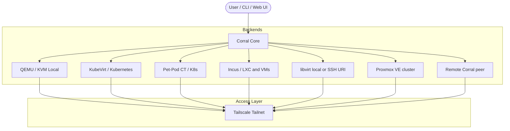
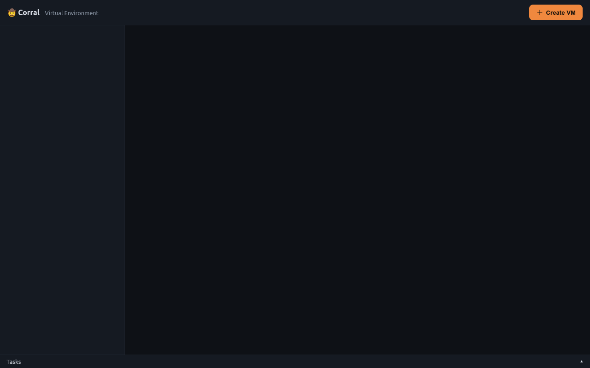
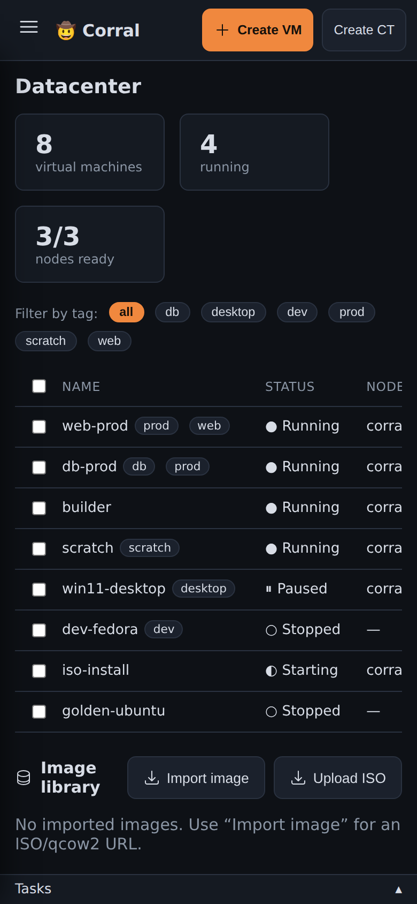
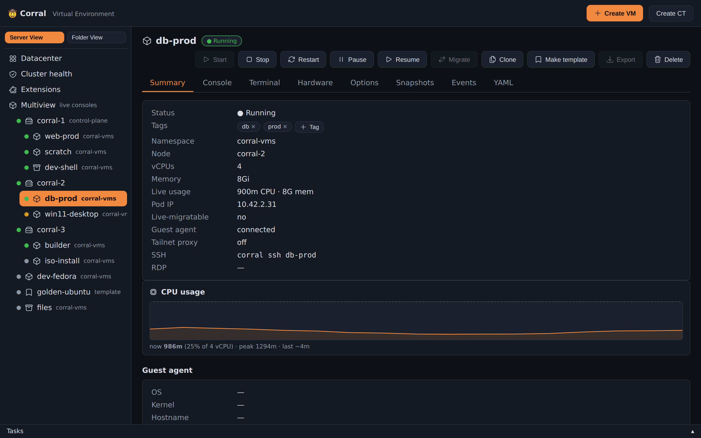
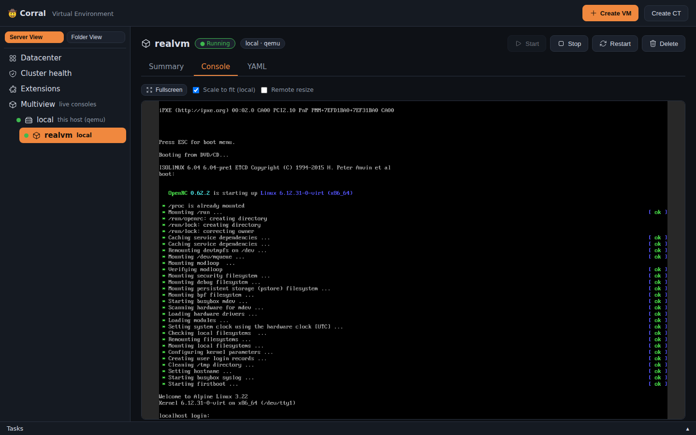

# Corral User Guide & Feature Manual

Welcome to the comprehensive user guide for **Corral** — the unified management platform for virtual machines, pet-pod containers, and local hypervisors.

## Backends, contexts, and peers

`corral config set-default-backend incus` makes unqualified creates use
Incus. `corral context list|set|get` switches Corral's context and does not
change kubectl or the Incus CLI; `--context` is a one-shot override.

Libvirt URIs make remote QEMU a normal backend, for example:
`corral context set qemu+ssh://hypervisor/system`.

A local dashboard can aggregate an in-cluster Corral without a local
kubeconfig: `corral peer add homelab https://corral.example.ts.net`.
Console routing tries the VM's advertised direct address first and relays
through the peer only when direct access is unavailable.

---

## 1. Overview & Architecture

Corral brings together diverse virtualization and container workloads under a single interface, CLI, and Tailscale network.



### Supported Compute Backends

| Backend | Scope | Tech Stack | Use Case |
|---|---|---|---|
| **QEMU** | Local Host | QEMU / KVM + systemd | Fast, local ephemeral or dev VMs on your workstation |
| **KubeVirt** | Cluster | KubeVirt + Kubernetes | Production VMs with live migration, PVC storage, and scaling |
| **Container (CT)** | Cluster | Kubernetes Pod + PVC | "Pet Pods" — persistent Linux containers (Distrobox on K8s) |
| **Incus** | Local or remote | Incus remote | Containers and VMs managed through existing Incus trust |
| **libvirt** | Local or remote | libvirt URI / OpenSSH | Existing domains and remote QEMU hypervisors |
| **Proxmox VE** | Cluster | Proxmox VE HTTPS REST API | VMs and LXC containers managed on existing PVE clusters |

---

## 2. Interactive Interfaces

### Web Dashboard

Access the Proxmox-style Web UI at `http://localhost:8006` or via `corral web`.




#### Features:
- **Datacenter Tree**: Navigate through all VMs, CTs, and Incus instances across local and cluster nodes.
- **Live CPU & Memory Sparklines**: Real-time load graphs for each VM.
- **Tag Filters**: Filter instances by custom tags (`prod`, `dev`, `desktop`).
- **Mobile Responsive**: Manage your VM fleet from your mobile browser.
- **Theme & Brand**: Customize accent colours and the header brand, and inject custom CSS. Use CLI flags, a config file, or the built-in Settings page.



#### Theme & Branding

In Corral's web UI, you can fully customize the accent colour, the header
brand, and custom CSS. You need no source-code changes.

**CLI flags** (highest priority, override everything):
```bash
corral web --accent \"#3b82f6\" --brand-title \"My Lab\" --brand-emoji \"⚡\" --brand-subtitle \"Engineering\"
```

**Config file** (`~/.config/corral/config.yaml`, loaded on startup):
```yaml
web:
  accent: \"#22c55e\"        # CSS hex colour
  accent_2: \"#16a34a\"      # hover/active variant
  brand_title: \"My Lab\"
  brand_emoji: \"⚡\"
  brand_subtitle: \"Engineering\"
  custom_css: |
    .btn.primary { border-radius: 20px; }
    .card { background: var(--panel-2); }
```

**Settings page** (web UI → Settings in the sidebar):
- Colour picker with preset swatches (Orange, Blue, Green, Purple, Red, Amber)
- Brand title, emoji, and subtitle fields with live header preview
- Custom CSS textarea that injects styles immediately as you type
- Save button persists to `config.yaml`

Precedence: CLI flags > config.yaml > built-in defaults (🤠 Corral, orange
accent).

---

### Terminal UI (TUI)

To launch the interactive TUI (built on Bubble Tea), run `corral` with no arguments. To explore in demo mode, run `corral --demo`.


The left side is a unified, searchable fleet. Wide terminals add a details
pane with canonical ID, backend/context, placement, address, resources, and
available operations. Failed remotes appear as partial-fleet warnings without
hiding healthy instances.

#### TUI keyboard shortcuts and features

- `/` fuzzy-searches names, canonical IDs, backends, contexts, nodes, and IPs.
- `Tab`, `[` and `]` cycle between the complete fleet and named contexts.
- `Enter` opens a capability-aware action menu. The menu leaves out
  unsupported operations, so they do not fail after you select them. These
  all live there: power (start/stop/restart/pause/resume), migrate, clone,
  snapshots, and events. So do the template mark, CPU/RAM, published ports,
  export, SSH, VNC, and delete.
- **Snapshots** opens the instance's captures: `n` takes one (named or
  auto-named), `Enter` restores, `x` deletes, `r` reloads. Corral supports every backend
  that can snapshot: KubeVirt, libvirt, Incus, and local QEMU. Each capture
  reports what it caught (offline, filesystem, or crash-consistent). This is
  the same as the web UI's Snapshots tab.
- **Events** shows the recent Kubernetes events for a KubeVirt VM and its
  `virt-launcher` pod, newest first.
- **Make/Unmark template** flips the golden-template label that
  `corral clone` copies from.
- CTs get their own smaller menu — start, stop, console, CPU/RAM, delete.
- `s` and `x` quickly start or stop the selected VM; `r` refreshes every
  backend.
- `d` runs scoped QEMU, KubeVirt, Incus, and libvirt diagnostics.
- The mouse works too. Click a row to select it, and scroll with the wheel.
  Double-click to open its actions (or to run the highlighted one). A click
  on a port row in the ports form toggles it. Destructive actions still go through
  their confirmation — a double click can't reach anything a keypress can't.
- `?` opens the in-app command deck.
- QEMU, KubeVirt, Incus, libvirt, and pet-pod CTs share the inventory without
  losing their backend-specific capabilities.

---

## 3. Core Feature Walkthrough

### 1. Instance Lifecycle Management

Create and manage instances across any backend with identical commands:

```bash
# Create local QEMU VM
corral create dev-vm --iso https://example.com/ubuntu.iso --disk 40G

# Create KubeVirt cluster VM
corral create prod-vm --kubevirt --image fedora

# Create on an existing Incus remote
corral create fast-ct --backend incus --context lab --image images:ubuntu/22.04

# Universal operations
corral start dev-vm
corral stop dev-vm
corral delete dev-vm
```

---

### 2. Remote Access: VNC, RDP & TTY

Corral provides single-command remote access to guest displays and shells:

#### In-Browser & Local VNC


- **VNC Display**: `corral viewer <vm-name>` opens a VNC session. In the Web UI, `noVNC` shows the display in the browser, with nothing to install.
- **Interactive TTY / SSH**: `corral ssh <vm-name>` or `corral tty <ct-name>` connects your terminal directly into guest shell namespaces (via SSH, `virtctl console`, or `incus exec`).



---

### 3. Bootable Container Images (`bootc`)

Boot containers directly as VMs using the `bootc` plugin:

```bash
corral plugin install bootc
corral bootc create my-node --image quay.io/centos-bootc/centos-bootc:stream9
```

- Builds a bootable OS disk on the cluster with `bootc install to-disk`.
- Upgrade the OS image of a guest with `corral bootc upgrade <vm-name>`.

#### Testing a bootc image (`corral vmtest`)

`corral vmtest` boots an image locally and tests it. It needs no plugin, and
it is what a CI pipeline should call:

```bash
corral vmtest gate --bootc ghcr.io/tuna-os/yellowfin:latest \
  --user tester --password hunter2 --sudo-user \
  --check 'systemctl --failed --no-legend'
ssh -i corral-vmtest-out/ssh/id_ed25519 -p 2242 tester@127.0.0.1
```

The run leaves the VM up, so the next step tests a real machine over SSH.
It also writes the guest's serial console, a screenshot of every stage of the
boot, an optional WebM timelapse, and `result.json`. Accounts, passwords,
packages and first-boot hooks go into a layer built on top of the image, which
is never modified. Full reference:
[docs/ci-boot-gate.md](ci-boot-gate.md).

---

### 4. Proxmox VE API Compatibility Layer

Corral includes a layer that emulates the REST API of Proxmox VE (`/api2/json/...`). With it, Terraform (`bpg/proxmox`), Ansible, and Proxmoxer tools can manage KubeVirt and Incus instances natively.

```bash
corral plugin install proxmox
corral proxmox serve --addr :8006
```

---

### 5. Plugin Marketplace

Expand Corral with lightweight marketplace plugins:

```bash
# Browse marketplace
corral plugin search

# Installed plugins
corral plugin list

# Plugin management
corral plugin install <name>
corral plugin remove <name>
```

#### Available Plugins:
- `bootc`: Builds VMs from bootable container images.
- `proxmox`: Compatibility server for the REST API of Proxmox VE.
- `backup`: S3/R2 VM disk backup & restore.
- `snapsched`: Automated schedules for VM snapshots, with retention rules.
- `schedule`: VM autostart and shutdown cron windows.
- `gpu`: GPU / PCI passthrough, via discovery of the device plugin.
- `windows`: First-class creation of Windows VMs (UEFI, TPM, virtio drivers).
- `vdi`: Desktop pools for Virtual Desktop Infrastructure (VDI).

---

## 4. Diagnostics & Troubleshooting

Run `corral doctor` to diagnose cluster capabilities, hypervisor support, and storage drivers:

```bash
corral doctor
```

In a multi-context setup it diagnoses every configured QEMU, KubeVirt, Incus,
libvirt, and Proxmox target. Use `corral doctor --context NAME` for one target. The
complete capability matrix and the direct-versus-relayed networking behavior
are in [backend-support.md](backend-support.md).

```
✓ KubeVirt installed (v1.8.2)
✓ CDI containerized data importer available
✓ Default StorageClass supports volume expansion
✓ VolumeSnapshotClass available for backups
✓ QEMU KVM hardware acceleration (/dev/kvm) accessible
✓ Incus daemon socket (/var/lib/incus/unix.socket) active
```

## Reproducible screenshots

Documentation captures use the real demo fleet that is built in. They are automated
for both Chromium and the Bubble Tea TUI:

```bash
npm install --prefix e2e
node scripts/capture-docs.mjs docs/screenshots/generated
```

The same command can target the TunaOS site checkout:
`node scripts/capture-docs.mjs ../docs/static/img/screenshots/corral`.

The `Screenshots` workflow runs this script when the web UI, the TUI or the
demo fleet changes, and one time each week. It then opens a PR with the new
images. When the `TUNAOS_DOCS_TOKEN` secret is set, it also opens a PR in
tuna-os/docs. That PR updates the images on the TunaOS site.
